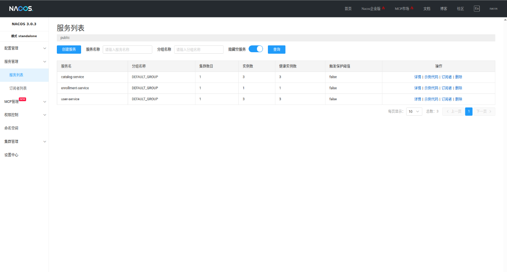
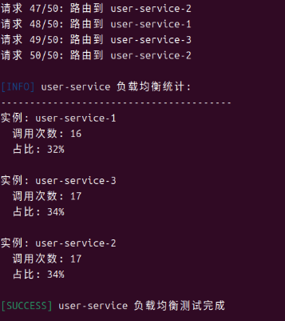
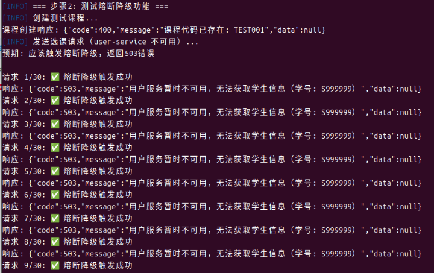
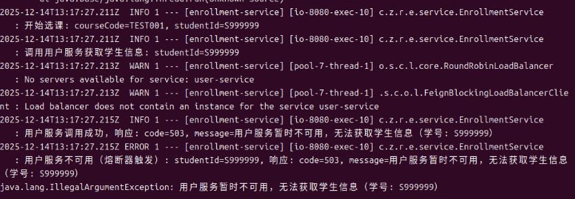
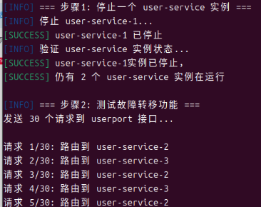
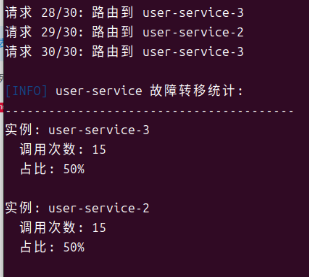

# 校园选课系统微服务项目

基于 Spring Boot 和 Spring Cloud 的校园选课系统微服务项目，使用 Nacos 作为服务注册与发现中心。

第八周
[docs/week08-notes.md 记录](https://github.com/kavic519/course-cloud/blob/master/docs/week08-notes.md "docs/week08-notes.md 记录")

## 项目概述

本项目是一个完整的校园选课系统，包含以下微服务：

1. **user-service** (用户服务) - 端口 8181-8183
   - 学生信息管理
   - 学生注册、查询、删除

2. **catalog-service** (课程目录服务) - 端口 8281-8283
   - 课程信息管理
   - 课程创建、查询、更新、删除
   - 课程容量管理

3. **enrollment-service** (选课服务) - 端口 8083
   - 学生选课功能
   - 选课记录管理
   - 课程容量验证

## 技术栈

- **后端框架**: Spring Boot 3.5.6, Spring Cloud 2025.0.0
- **服务注册与发现**: Nacos 3.0.3
- **数据库**: MySQL 8.0
- **ORM框架**: Spring Data JPA
- **API文档**: Spring Boot Actuator
- **容器化**: Docker, Docker Compose
- **负载均衡**: Spring Cloud LoadBalancer

## 快速开始

### 1. 环境要求

- Docker 和 Docker Compose
- JDK 17+
- Maven 3.6+

### 2. 启动所有服务


#### 方式一：使用 Docker Compose 命令
```bash
# 使用 Docker Compose 启动所有服务
docker-compose up -d
```


#### 方式二：使用启动脚本（Linux/Mac）
```bash
# 给脚本添加执行权限
chmod +x run.sh

# 运行脚本
./run.sh
```

### 3. 验证服务状态

```bash
# 查看所有容器状态
docker-compose ps

# 查看服务日志
docker-compose logs -f user-service
docker-compose logs -f catalog-service
docker-compose logs -f enrollment-service
```

## Nacos 部署和配置

### Nacos 控制台访问

- **访问地址**: http://localhost:8080
- **默认账号**: nacos
- **默认密码**: nacos

### Nacos 配置说明

#### 1. Nacos 服务配置

在 `docker-compose.yml` 中，Nacos 配置如下：

```yaml
nacos:
  image: nacos/nacos-server:v3.0.3
  container_name: nacos-server
  environment:
    - MODE=standalone  # 单机模式
    - SPRING_DATASOURCE_PLATFORM=mysql  # 使用 MySQL 存储
    - MYSQL_SERVICE_HOST=nacos-db  # MySQL 主机
    - MYSQL_SERVICE_DB_NAME=nacos  # 数据库名
    - NACOS_AUTH_ENABLE=true  # 启用认证
  ports:
    - "8848:8848"  # 服务端口
    - "9848:9848"  # gRPC 端口
```

#### 2. 微服务 Nacos 配置

每个微服务的 `application.yml` 中都配置了 Nacos 服务发现：

```yaml
spring:
  application:
    name: user-service  # 服务名称
  cloud:
    nacos:
      discovery:
        server-addr: nacos:8848  # Nacos 服务器地址
        username: nacos  # 认证用户名
        password: nacos  # 认证密码
        namespace: public  # 命名空间
        group: DEFAULT_GROUP  # 分组
```

#### 3. 服务注册验证

服务启动后会自动注册到 Nacos。可以通过以下方式验证：

1. 访问 Nacos 控制台: http://localhost:8080
2. 登录后进入 "服务管理" -> "服务列表"
3. 应该能看到三个注册的服务：
   - user-service
   - catalog-service
   - enrollment-service

### 服务发现截图

#### 1. Nacos 控制台服务列表



*截图说明：Nacos 控制台中显示三个微服务已成功注册*

#### 2. 多实例负载均衡效果



*截图说明：通过多次请求 user-service，响应中显示不同的实例端口号，证明负载均衡生效*

#### 3. 熔断降级测试



*截图说明：停止全部 user-service 实例后，请求服务不可用时返回默认数据，证明熔断降级处理正常工作*


#### 4. 故障转移效果




*截图说明：停止一个 user-service 实例后，请求仍然成功，证明故障转移机制正常工作*

## 服务间通信

### 1. 服务发现机制

微服务通过服务名进行通信，而不是硬编码的 IP 地址：

```java
// 在 enrollment-service 中调用 user-service
private static final String USER_SERVICE_NAME = "user-service";
String studentUrl = "http://" + USER_SERVICE_NAME + "/api/students?studentid=" + studentId;
```

### 2. 负载均衡配置

使用 Spring Cloud LoadBalancer 实现客户端负载均衡：

```java
@FeignClient(
    name = "user-service",
    fallback = UserClientFallback.class
)
public interface UserClient {
    
    @GetMapping("/api/students/studentId/{studentId}")
    ApiResponse<StudentDto> getStudentByStudentId(@PathVariable("studentId") String studentId);
    
    @GetMapping("/api/students/{id}")
    ApiResponse<StudentDto> getStudentById(@PathVariable("id") String id);
}
```

### 4. 故障转移机制

当某个服务实例不可用时，LoadBalancer 会自动将请求路由到其他健康实例。

## API 文档

### 用户服务 (user-service:8181-8183)

| 方法 | 端点 | 描述 |
|------|------|------|
| GET | `/api/students` | 获取所有学生 |
| GET | `/api/students?studentid={id}` | 根据学号查询学生 |
| POST | `/api/students` | 创建学生 |
| DELETE | `/api/students/{id}` | 删除学生 |

### 课程目录服务 (catalog-service:8281-8283)

| 方法 | 端点 | 描述 |
|------|------|------|
| GET | `/api/courses` | 获取所有课程 |
| GET | `/api/courses/{id}` | 根据ID获取课程 |
| GET | `/api/courses/code/{code}` | 根据课程代码获取课程 |
| POST | `/api/courses` | 创建课程 |
| PUT | `/api/courses/{id}` | 更新课程 |
| PATCH | `/api/courses/{id}` | 部分更新课程（如更新选课人数） |
| DELETE | `/api/courses/{id}` | 删除课程 |

### 选课服务 (enrollment-service:8083)

| 方法 | 端点 | 描述 |
|------|------|------|
| GET | `/api/enrollments` | 获取所有选课记录 |
| GET | `/api/enrollments/course/{courseId}` | 获取课程的选课记录 |
| GET | `/api/enrollments/student/{studentId}` | 获取学生的选课记录 |
| POST | `/api/enrollments` | 学生选课 |
| DELETE | `/api/enrollments/{enrollmentId}` | 学生退课 |

## 测试脚本

项目提供了多个测试脚本，可以测试微服务的不同功能：

### 1. 多实例负载均衡测试脚本
```bash
# Linux/Mac: 运行多实例负载均衡测试脚本
./test.sh
```

测试脚本会：
1. 检查服务可用性
2. 检查 Nacos 中的实例数量
3. 通过 enrollment-service发送多次请求到 user-service (50次) 和 catalog-service (50次)
4. 统计不同端口出现的次数
5. 展示负载均衡效果（检测到多个不同端口表示负载均衡生效）

**特别说明**: 此脚本专门用于测试多实例负载均衡效果。已知 user-server 开启了3个实例，course-server 也开启了3个实例，端口各不相同。脚本会验证负载均衡器是否将请求分发到不同的实例。

### 2. 熔断降级测试
```bash
# 测试熔断降级功能
./test2.sh
```
测试脚本会：
1. 检查服务可用性
2. 停止所有user-service实例
3. 通过 enrollment-service发送选课多次请求到 user-service (30次)
4. 统计响应


### 3. 负载均衡故障转移测试
```bash
# 测试负载均衡的故障转移功能
./test3.sh
```

**测试场景**:
- 当多实例服务中的某一个实例关闭时（例如停止端口8181的user-service）
- 其他实例还能正常提供服务
- 验证负载均衡器的健康检查和故障转移机制

**测试特点**:
- **真实故障模拟**: 实际停止一个服务实例
- **故障转移验证**: 验证请求被自动路由到其他健康实例
- **服务间调用测试**: 通过 enrollment-service 测试服务间调用的故障恢复
- **自动恢复测试**: 测试重启停止的实例后系统恢复正常
- **完整的测试流程**: 包括故障注入、测试验证、系统恢复

**测试流程**:
1. 检查所有服务实例可用性
2. 创建测试数据（学生和课程）
3. 停止指定端口的 catalog-service 实例（例如8182）
4. 测试故障转移效果（验证请求被路由到其他实例）
5. 测试通过 enrollment-service 的故障转移（验证服务间调用）
6. 重启停止的实例
7. 清理测试数据
8. 生成详细的故障转移测试报告

**关键验证点**:
- 负载均衡器能够检测到实例不可用
- 请求被自动重路由到其他健康的实例
- 系统整体服务不受单个实例故障影响
- 服务间调用具有容错能力
- 实例恢复后系统能够自动重新纳入负载均衡

**故障转移机制**:
1. **健康检查**: 负载均衡器定期检查服务实例健康状态
2. **故障检测**: 当实例不可用时，负载均衡器将其标记为不健康
3. **请求重路由**: 新请求被路由到其他健康实例
4. **自动恢复**: 当实例恢复后，负载均衡器自动将其重新纳入服务池

## 故障排除

### 常见问题

1. **服务无法注册到 Nacos**
   - 检查 Nacos 容器是否正常运行：`docker-compose ps nacos`
   - 检查 Nacos 日志：`docker-compose logs nacos`
   - 验证网络连接：确保微服务容器能访问 `nacos:8848`

2. **服务间调用失败**
   - 检查服务是否已注册到 Nacos
   - 验证 `@LoadBalanced` RestTemplate 配置
   - 检查服务名称是否正确

3. **数据库连接失败**
   - 检查数据库容器是否正常运行
   - 验证数据库连接配置
   - 检查网络连接

### 日志查看

```bash
# 查看所有服务日志
docker-compose logs -f

# 查看特定服务日志
docker-compose logs -f user-service
docker-compose logs -f catalog-service
docker-compose logs -f enrollment-service
```

## 项目结构

```
course-cloud/
├── docker-compose.yml          # Docker Compose 配置文件
├── README.md                   # 项目文档
├── user-service/               # 用户服务
│   ├── src/main/java/
│   ├── src/main/resources/
│   └── Dockerfile
├── catalog-service/            # 课程目录服务
│   ├── src/main/java/
│   ├── src/main/resources/
│   └── Dockerfile
├── enrollment-service/         # 选课服务
│   ├── src/main/java/
│   ├── src/main/resources/
│   └── Dockerfile
└── nacos/                      # Nacos 初始化脚本
    └── init.sql
```
