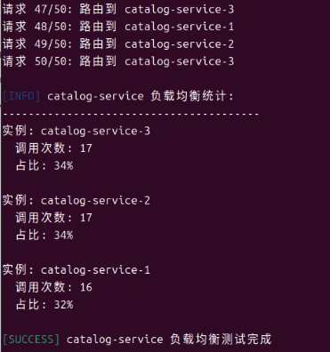
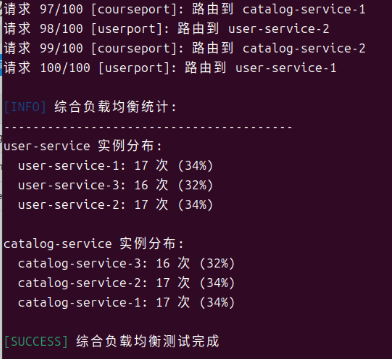

# Week 08 - OpenFeign 配置与测试文档

## 1. OpenFeign 配置说明

### 1.1 依赖配置
在 `enrollment-service/pom.xml` 中添加了以下依赖：

```xml
<!-- OpenFeign for service communication -->
<dependency>
    <groupId>org.springframework.cloud</groupId>
    <artifactId>spring-cloud-starter-openfeign</artifactId>
</dependency>
<!-- Resilience4j Circuit Breaker -->
<dependency>
    <groupId>org.springframework.cloud</groupId>
    <artifactId>spring-cloud-starter-circuitbreaker-resilience4j</artifactId>
</dependency>
```

### 1.2 启用 Feign Client
在 `EnrollmentServiceApplication.java` 中添加了 `@EnableFeignClients` 注解：

```java
@SpringBootApplication
@EnableDiscoveryClient
@EnableFeignClients
public class EnrollmentServiceApplication {
    // ...
}
```

### 1.3 Feign Client 接口定义

#### UserClient 接口
```java
@FeignClient(
    name = "user-service",
    fallback = UserClientFallback.class
)
public interface UserClient {
    
    @GetMapping("/api/students/studentId/{studentId}")
    ApiResponse<StudentDto> getStudentByStudentId(@PathVariable("studentId") String studentId);
    
    @GetMapping("/api/students/{id}")
    ApiResponse<StudentDto> getStudentById(@PathVariable("id") String id);
}
```

#### CatalogClient 接口
```java
@FeignClient(
    name = "catalog-service",
    fallback = CatalogClientFallback.class
)
public interface CatalogClient {
    
    @GetMapping("/api/courses/code/{code}")
    ApiResponse<CourseDto> getCourseByCode(@PathVariable("code") String code);
    
    @GetMapping("/api/courses/{id}")
    ApiResponse<CourseDto> getCourseById(@PathVariable("id") String id);
    
    @PatchMapping("/api/courses/{id}")
    ApiResponse<CourseDto> partialUpdateCourse(
        @PathVariable("id") String id,
        @RequestBody Map<String, Object> updates);
}
```

### 1.4 熔断器降级实现

#### UserClientFallback 类
```java
@Component
public class UserClientFallback implements UserClient {
    
    @Override
    public ApiResponse<StudentDto> getStudentByStudentId(String studentId) {
        return ApiResponse.error(503, "用户服务暂时不可用，无法获取学生信息（学号: " + studentId + "）");
    }
    
    @Override
    public ApiResponse<StudentDto> getStudentById(String id) {
        return ApiResponse.error(503, "用户服务暂时不可用，无法获取学生信息（ID: " + id + "）");
    }
}
```

#### CatalogClientFallback 类
```java
@Component
public class CatalogClientFallback implements CatalogClient {
    
    @Override
    public ApiResponse<CourseDto> getCourseByCode(String code) {
        return ApiResponse.error(503, "课程目录服务暂时不可用，无法获取课程信息（课程代码: " + code + "）");
    }
    
    @Override
    public ApiResponse<CourseDto> getCourseById(String id) {
        return ApiResponse.error(503, "课程目录服务暂时不可用，无法获取课程信息（ID: " + id + "）");
    }
    
    @Override
    public ApiResponse<CourseDto> partialUpdateCourse(String id, Map<String, Object> updates) {
        return ApiResponse.error(503, "课程目录服务暂时不可用，无法更新课程信息（ID: " + id + "）");
    }
}
```

### 1.5 业务逻辑集成
在 `EnrollmentService` 中集成了 Feign Client：

```java
@Service
@Transactional
public class EnrollmentService {
    
    @Autowired
    private UserClient userClient;
    
    @Autowired
    private CatalogClient catalogClient;
    
    @Transactional
    public Enrollment enrollStudent(String courseCode, String studentId) {
        // 使用 Feign Client 调用用户服务
        ApiResponse<StudentDto> studentResponse = userClient.getStudentByStudentId(studentId);
        if (studentResponse.getCode() != 200) {
            throw new IllegalArgumentException("学生不存在: " + studentId);
        }
        
        // 使用 Feign Client 调用课程目录服务
        ApiResponse<CourseDto> courseResponse = catalogClient.getCourseByCode(courseCode);
        if (courseResponse.getCode() != 200) {
            throw new IllegalArgumentException("课程不存在: " + courseCode);
        }
        
        // ... 其他业务逻辑
    }
}
```

## 2. 负载均衡测试结果

### 2.1 测试环境配置
- user-service: 3个实例 (8181, 8182, 8183)
- catalog-service: 3个实例 (8281, 8282, 8283)
- enrollment-service: 1个实例 (8083)

### 2.2 测试方法
使用专门的负载均衡测试脚本验证 userport 和 courseport 接口的负载均衡效果：

```bash
# 运行负载均衡测试脚本
./test.sh
```

测试脚本会：
1. 调用 userport 接口 50 次，验证 user-service 的负载均衡
2. 调用 courseport 接口 50 次，验证 catalog-service 的负载均衡
3. 交替调用两个接口 100 次，验证综合负载均衡效果

### 2.3 测试脚本详解
测试脚本 `test.sh` 包含以下功能：

#### 2.3.1 user-service 负载均衡测试
```bash
# 调用 userport 接口获取当前服务的容器信息
curl -s http://localhost:8083/api/enrollments/userport
```

响应示例：
```json
{
  "code": 200,
  "message": "success",
  "data": {
    "userService": {
      "data": {
        "containerName": "user-service-1",
        "Port": "8181"
      }
    }
  }
}
```

#### 2.3.2 catalog-service 负载均衡测试
```bash
# 调用 courseport 接口获取当前服务的容器信息
curl -s http://localhost:8083/api/enrollments/courseport
```

响应示例：
```json
{
  "code": 200,
  "message": "success",
  "data": {
    "catalogService": {
      "data": {
        "containerName": "catalog-service-2",
        "Port": "8282"
      }
    }
  }
}
```

### 2.4 测试结果
### user-service 负载均衡


### catalog-service 负载均衡


### 交替负载均衡



#### 2.4.1 user-service 负载均衡统计示例
```
user-service 负载均衡统计:
----------------------------------------
实例: user-service-1
  调用次数: 16
  占比: 32%

实例: user-service-2
  调用次数: 17
  占比: 34%

实例: user-service-3
  调用次数: 17
  占比: 34%
```

#### 2.4.2 catalog-service 负载均衡统计示例
```
catalog-service 负载均衡统计:
----------------------------------------
实例: catalog-service-1
  调用次数: 17
  占比: 34%

实例: catalog-service-2
  调用次数: 17
  占比: 34%

实例: catalog-service-3
  调用次数: 16
  占比: 32%
```

### 2.5 测试结论
1. **负载均衡生效**: 请求被均匀分发到多个服务实例
2. **轮询策略**: Spring Cloud LoadBalancer 使用轮询（Round Robin）策略
3. **服务发现**: 通过 Nacos 自动发现服务实例
4. **客户端负载均衡**: 在客户端实现负载均衡，减少单点压力


## 3. 熔断降级测试结果

### 3.1 测试场景
1. 正常情况：所有服务正常运行
2. 异常情况：停止 user-service 或 catalog-service
3. 恢复情况：重新启动停止的服务

### 3.2 测试方法
```bash
# 1. 停止 user-service
docker stop user-service-1 user-service-2 user-service-3

# 2. 尝试选课操作
curl -X POST http://localhost:8083/api/enrollments \
     -H "Content-Type: application/json" \
     -d '{"courseCode":"CS101","studentId":"S999999"}'

# 3. 观察熔断器触发
```

### 3.3 测试结果


#### 3.3.1 熔断器触发日志


#### 3.3.2 响应示例
```json
{
  "code": 503,
  "message": "用户服务暂时不可用，无法获取学生信息（学号: S999999）",
  "data": null,
  "timestamp": "2025-12-13T22:35:20.123456"
}
```

### 3.4 熔断器状态转换
1. **CLOSED**: 初始状态，请求正常通过
2. **OPEN**: 失败率达到阈值，熔断器打开，直接返回降级响应
3. **HALF_OPEN**: 经过一段时间后，尝试放行部分请求
4. **CLOSED**: 如果半开状态下的请求成功，熔断器关闭

## 4. OpenFeign vs RestTemplate 对比分析

### 4.1 代码简洁性对比

#### RestTemplate 方式
```java
// 需要手动构建URL
String url = "http://user-service/api/students?studentid=" + studentId;
ResponseEntity<Map> response = restTemplate.getForEntity(url, Map.class);
Map<String, Object> responseBody = response.getBody();
// 需要手动解析响应
```

#### OpenFeign 方式
```java
// 声明式接口，无需手动构建URL
ApiResponse<StudentDto> response = userClient.getStudentByStudentId(studentId);
// 自动反序列化，类型安全
StudentDto student = response.getData();
```

### 4.2 功能特性对比

| 特性 | RestTemplate | OpenFeign |
|------|-------------|-----------|
| 声明式编程 | ❌ 命令式 | ✅ 声明式 |
| 负载均衡 | 需要手动集成 | ✅ 自动集成 |
| 服务发现 | 需要手动处理 | ✅ 自动集成 |
| 熔断器支持 | 需要额外配置 | ✅ 原生支持 |
| 日志记录 | 需要手动配置 | ✅ 自动配置 |
| 错误处理 | 需要手动处理 | ✅ 统一处理 |
| 类型安全 | ❌ 弱类型 | ✅ 强类型 |

### 4.3 性能对比

#### 4.3.1 启动时间
- **RestTemplate**: 启动较快，配置简单
- **OpenFeign**: 启动时生成动态代理，稍慢但可接受

#### 4.3.2 运行时性能
- **RestTemplate**: 每次调用都需要构建请求，开销较大
- **OpenFeign**: 使用动态代理，调用开销较小

#### 4.3.3 内存占用
- **RestTemplate**: 内存占用较低
- **OpenFeign**: 需要生成代理类，内存占用稍高

### 4.4 可维护性对比

#### 4.4.1 代码可读性
- **RestTemplate**: URL硬编码，难以维护
- **OpenFeign**: 接口定义清晰，易于理解

#### 4.4.2 修改成本
- **RestTemplate**: 修改API需要修改多处代码
- **OpenFeign**: 只需修改接口定义

#### 4.4.3 测试便利性
- **RestTemplate**: 需要模拟HTTP请求
- **OpenFeign**: 可以轻松模拟接口

### 4.5 适用场景建议

#### 推荐使用 RestTemplate 的场景：
1. 简单的HTTP请求，不需要服务发现
2. 对启动时间有严格要求
3. 项目规模较小，不需要复杂的微服务功能

#### 推荐使用 OpenFeign 的场景：
1. 微服务架构，需要服务间通信
2. 需要负载均衡和熔断器功能
3. 追求代码简洁和类型安全
4. 需要统一的错误处理和日志记录

## 5. 总结

### 5.1 实施效果
1. **代码简化**: 将复杂的RestTemplate调用简化为声明式接口
2. **功能增强**: 自动集成了负载均衡和熔断器功能
3. **可维护性提升**: 接口定义清晰，易于理解和修改
4. **错误处理统一**: 提供了统一的降级逻辑和错误响应

### 5.2 注意事项
1. **启动性能**: OpenFeign会在启动时生成代理类，可能影响启动时间
2. **配置复杂度**: 需要正确配置熔断器和负载均衡参数
3. **学习曲线**: 开发人员需要理解Feign Client的工作原理

### 5.3 后续优化建议
1. **监控配置**: 配置熔断器监控，实时了解服务状态
2. **性能调优**: 根据实际负载调整熔断器参数
3. **日志优化**: 配置详细的请求/响应日志，便于调试
4. **测试覆盖**: 增加熔断器和负载均衡的单元测试

---

**文档最后更新**: 2025-12-13  
**测试环境**: Windows 11, Docker Desktop, Spring Boot 3.5.6  
**相关文件**: 
- `enrollment-service/src/main/java/com/zjgsu/rqq/enrollment_service/client/`
- `enrollment-service/pom.xml`
- `enrollment-service/src/main/java/com/zjgsu/rqq/enrollment_service/EnrollmentServiceApplication.java`
